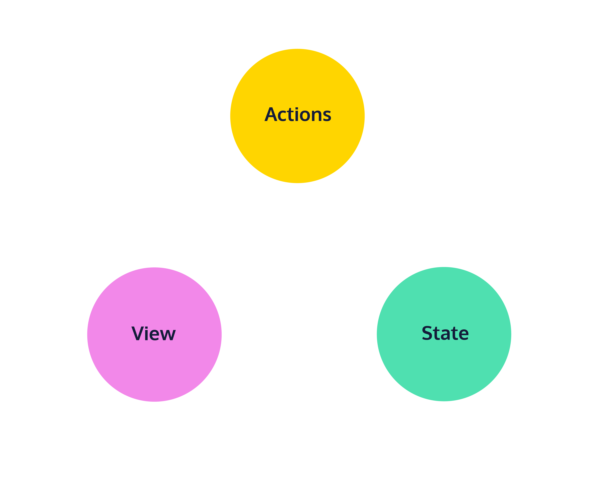

## Redux

Redux is most commonly used with React to manage application state (in React), but can also be used with other libraries and frameworks, such as Angular. Redux is good for when your application becomes very large and has lots of moving parts. Redux is a middleware technology.

Redux uses Flux Architecture.

## Flux

In the Flux pattern, and in Redux, shared information is not stored in components but in a single object. Components are “notified” whenever a change is made to the state.

There is an initial State that renders a View and the View gives the user Actions to modify the State.



### States

> With Redux states can be any JS type: num, bool, str, arr, or obj.  
> A sample index.js could hold a state:  
> `const state = ['Take Five', 'Claire de Lune', 'Respect']`

### Actions

Beside states, there are also actions. Actions represent a way to interact with the state. A sample action has a type and a payload. Type is a string that describes the action, payloads contain information objects related to the action.  
When the action is generated and notifies other parts we say it's "dispatched".

> `const action = { type: 'todos/addTodo', payload: 'Take selfies' };`

An action could not need a payload if the information is not needed, for example:

> `const action = { type: 'todos/removeAll' }`

But maybe you do need to know something to execute it. The payload specifies which object to remove from the Todo.

> `const action = { type: 'todos/removeTodo', payload: 'Pack snacks' }`

There are also Reducer functions, that state how the action must be applied to the state

### Reducers

Reducers state how the action must be applied to the state.

1. Reducers are always plain JS functions.
2. It defines the application’s next state given a current state and a specific action.
3. It returns a default initial state if no action is provided.
4. It returns the current state if the action is not recognized.

for example:

```
const reducer = (state = initialState, action) => {
	switch (action.type) {
		case "songs/addSong":
			return [...state, action.payload];
		case "songs/removeSong":
			return state.filter((song) => song !== action.payload);
		default:
			return state;
	}
};
```

In the example we set a default value with = for state (initialState) and we also provide a default if the action is not found.

## 3 rules of reducers

1. They should only calculate the new state value based on the state and action arguments.
2. They are not allowed to modify the existing state. Instead, they must copy the existing state and make changes to the copied values.
3. They must not do any asynchronous logic or have other “side effects”.

These 3 rules can be summarized in the fact that reducers must make **immutable updates** and be **pure functions**.

## Immutable updates

Shallow copy update returns the same obj.

> `const mutableUpdate = (obj) => !obj.property;`

Deep copy (non mutable) update returns a new obj.

> `const nonMutableUpdate = (obj) => ({ ...obj, property: !obj.property });`

## Pure functions

Pure functions will always have the same outputs given the same inputs. No random shenanigans, async logics or the likes.

Not pure function, it relies on fetch

```
const addItemToList = (list) => {
	let item;
	fetch("https://anything.com/endpoint").then((response) => {
		if (!response.ok) {
			item = {};
		}
		item = response.json();
	});
	return [...list, item];
};

```

Pure function variation of this action

```
let item;
  fetch('https://anything.com/endpoint')
    .then(response => {
      if (!response.ok) {
        item = {};
      }

      item = response.json();
   });

const addItemToList = (list, item) => {
    return [...list, item];
};
```

## Redux API

The dedicated redux library provides useful tools for handling most common aspects of building a redux app.

You can use createStore() to create a store that handles the changeState requests. You can then use store.getState(), store.dispatch(action) and store.subscribe(listener).

An advance method is store.replaceReducer(nextReducer).

## Getting Started

We will use createStore, although it is not the recommended method.

> To install `npm install redux`.

> To import redux methods `import {createStore} from 'redux'`

The docs recommend to use reduxjs toolkit

> ```
> npm install @reduxjs/toolkit // redux toolkit
> npm install react-redux // standard redux library
> npm install --save-dev @redux-devtools/core // redux devtools
> npx create-react-app my-app --template redux // to create react app with redux
> ```
>
> To import redux methods `import {configureStore} from 'redux'`

## Slices

For large apps stores will manage complex states, so an object is the best way to store it.

```
// For example
state = {
  todos: [
    {
      id: 0,
      text: 'Complete the Learn Redux course',
      isCompleted: false
    },
    {
      id: 1,
      text: 'Build a counter app',
      isCompleted: true
    },
  ],
  visibilityFilter: 'SHOW_INCOMPLETE'
};
```

Each property, for example `state.todos` and `state.visibilityFilter`, are known as `slices`.

It is recommended to have an `initialState` declared.

```
const initialState = {
  todos: [],
  visibilityFilter: 'SHOW_ALL'
};
const todosReducer = (state = initialState, action) => {
  // rest of todosReducer logic omitted
};
```

It is recommended that individual actions only change one slice at a time, therefore the action type should follow the pattern `'sliceName/actionDescriptor'` for example `'todos/addTodo'`

## Reducer Composition

We use reducer composition to create separate reducers responsible for updating each slice of the applications state, and they are merged into a rootReducer to form a single state object.

For example:

```
// Handles only `state.todos`.
const initialTodos = [
  { id: 0, text: 'learn redux', completed: false },
  { id: 1, text: 'build a redux app', completed: true },
  { id: 2, text: 'do a dance', completed: false },
];
const todosReducer = (todos = initialTodos, action) => {
  switch (action.type) {
    case 'todos/addTodo':
      return [...todos, action.payload]
    case 'todos/toggleTodo':
      return todos.map(todo => {
        return (todo.id === action.payload.id) ?
          { ...todo, completed: !todo.completed } :
          {...todo};
      });
    default:
      return todos;
  }
};

// Handles only `state.filter`
const initialFilter = 'SHOW_INCOMPLETE',
const filterReducer = (filter = initialFilter, action) => {
  switch (action.type) {
    case 'filter/setFilter':
      return action.payload;
    default:
      return filter;
};

const rootReducer = (state = {}, action) => {
  const nextState = {
    todos: todosReducer(state.todos, action),
    filter: filterReducer(state.filter, action)
  };
  return nextState;
};

const store = createStore(rootReducer);
```

## Combine Reducers

The redux package provides the combineReducers() method to combine several reducers into one.

```
import { createStore, combineReducers } from 'redux'

// todosReducer and filterReducer omitted.

const reducers = {
todos: todosReducer,
filter: filterReducer
};
const rootReducer = combineReducers(reducers);
const store = createStore(rootReducer);

// or you could simply run

const store = createStore(combineReducers({
    todos: todosReducer,
    filter: filterReducer
}));

```

## File Logic

Since there could be a lot of slices in the state, the recommended Redux Ducks pattern should be applied:

```
src/
|-- index.js
|-- app/
    |-- store.js
|-- components/
    |-- ComponentA.js
    |-- ComponentB.js
|-- features/
    |-- featureA/
        |-- featureASlice.js
    |-- featureB/
        |-- featureBSlice.js
```
